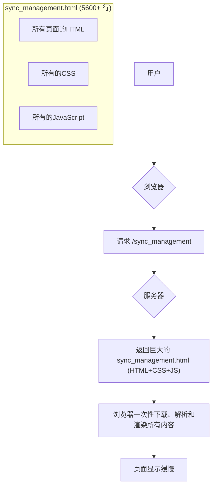
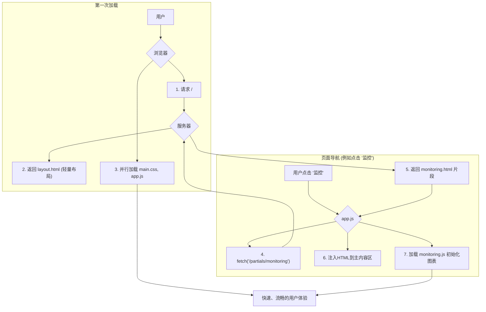

# 前端架构设计指南 (Frontend Architecture Guide)

**版本**: v2.0  
**创建时间**: 2025-06-29  
**最后更新**: 2025-06-29  
**状态**: ✅ 设计完成

## 📋 项目概述

本文档详细说明了飞书-Notion同步管理系统的前端架构设计、UI设计理念、技术实现和重构优化方案。该系统是一个现代化的企业级协作工具管理界面，专为数据同步管理而设计。

---

## 🎯 设计目标

### 核心目标
- **状态可视化**: 让复杂的同步状态一目了然
- **操作效率**: 简化配置流程，提升管理效率  
- **信任感建立**: 通过专业的视觉设计增强用户对系统稳定性的信心
- **错误处理**: 优雅地处理异常情况，提供清晰的解决方案

### 设计原则
- **简洁明了**: 减少视觉噪音，突出核心信息
- **一致性**: 统一的设计语言和交互模式
- **响应式**: 适配多种设备和屏幕尺寸
- **可访问性**: 支持键盘导航和屏幕阅读器

---

## 🏗️ 架构重构方案

### 核心问题分析

当一个HTML文件（如 `templates/sync_management.html`，超过5600行）包含所有页面的结构、全部的CSS样式和所有的JavaScript逻辑时，会引发几个严重的性能问题：

1. **加载缓慢**：浏览器必须一次性下载整个巨大的文件，导致首次访问时出现长时间的白屏。
2. **渲染阻塞**：解析一个庞大的DOM树、CSS和JavaScript会消耗大量CPU和内存，拖慢页面渲染速度。
3. **维护困难**：所有代码高度耦合，修改一个功能很容易影响到其他部分，增加了开发和调试的难度。

### 重构优化计划

为了解决这个问题，建议对前端代码进行一次彻底的模块化重构，从根本上解决性能瓶颈，并提升代码的可维护性。

#### 第一步：分离静态资源 (CSS 和 JavaScript)

1. **CSS分离**：将 `<style>` 标签内的所有CSS代码移至外部文件 `static/css/main.css`，并通过 `<link>` 标签在HTML中引入。
2. **JavaScript分离**：将 `<script>` 标签内所有的JS代码进行拆分：
   - **核心逻辑**: `static/js/app.js` (页面导航、初始化)
   - **API服务**: `static/js/api.js` (封装所有 `fetch` 请求)
   - **UI组件**: `static/js/ui.js` (模态框、图表、通知等)
   - **页面专属逻辑**: 为每个页面创建单独的JS文件，如 `static/js/dashboard.js`, `static/js/configs.js` 等，按需加载。

#### 第二步：拆分HTML页面 (模板组件化)

1. **创建主布局**: 新建 `templates/layout.html`，包含所有页面的公共部分（如 `<head>`, 侧边栏，以及一个用于动态加载内容的主容器）。
2. **创建页面片段**: 将原文件中各个独立的页面（如 `dashboard-page`, `configs-page`）提取到 `templates/partials/` 目录下，如 `templates/partials/dashboard.html`, `templates/partials/configs.html` 等。

#### 第三步：实现动态内容加载

1. **初始加载**: Flask后端首先渲染并返回轻量级的 `templates/layout.html`。
2. **按需加载**: 当用户点击导航时，JavaScript将：
   - 拦截页面跳转。
   - 通过 `fetch` 异步请求对应的HTML片段（例如 `/partials/dashboard`）。
   - 将返回的HTML注入到主布局的容器中。
   - 动态加载并执行该页面专属的JavaScript文件，完成页面初始化。

---

## 🎨 设计系统

### 色彩规范

```css
:root {
    --primary-blue: #1E40AF;      /* 主色调 - 专业稳定 */
    --success-green: #10B981;     /* 成功状态 - 同步完成 */
    --warning-orange: #F59E0B;    /* 警告状态 - 需要注意 */
    --error-red: #EF4444;         /* 错误状态 - 同步失败 */
    --neutral-gray: #6B7280;      /* 中性色 - 次要信息 */
    --bg-gray: #F9FAFB;          /* 背景色 - 减少视觉疲劳 */
}
```

### 字体系统
- **中文字体**: Noto Sans SC
- **英文字体**: Inter
- **字体大小**: 12px-32px，遵循8px网格系统

### 间距系统
- **基础间距**: 4px的倍数 (4px, 8px, 12px, 16px, 24px, 32px, 48px)
- **容器间距**: 24px (移动端), 32px (桌面端)

---

## 🏗️ 组件架构

### 布局组件

#### 1. 侧边导航栏 (Sidebar)
```html
<!-- 桌面端侧边栏 -->
<div id="sidebar" class="sidebar-transition bg-white shadow-lg">
    <!-- 导航内容 -->
</div>

<!-- 移动端侧边栏 -->
<div id="mobile-sidebar" class="mobile-only fixed transform -translate-x-full">
    <!-- 移动端导航内容 -->
</div>
```

**特性**:
- 桌面端固定宽度 250px
- 移动端滑动抽屉式
- 支持展开/收缩动画
- 包含用户信息和系统状态

#### 2. 顶部状态栏 (Header)
```html
<header class="bg-white shadow-sm border-b">
    <div class="flex items-center justify-between">
        <!-- 页面标题和状态指示器 -->
        <!-- 快捷操作按钮 -->
    </div>
</header>
```

**特性**:
- 显示当前页面标题
- 实时系统状态指示
- 快捷操作入口
- API连接状态显示

### 功能组件

#### 1. 状态指示器 (Status Indicator)
```css
.status-indicator {
    width: 8px;
    height: 8px;
    border-radius: 50%;
    display: inline-block;
    margin-right: 8px;
}

.status-running { background-color: var(--success-green); }
.status-stopped { background-color: var(--neutral-gray); }
.status-error { background-color: var(--error-red); }
.status-warning { background-color: var(--warning-orange); }
```

#### 2. 卡片组件 (Card)
```html
<div class="card-hover bg-white rounded-lg shadow-sm border p-6">
    <!-- 卡片内容 -->
</div>
```

**特性**:
- 悬停动画效果
- 统一的圆角和阴影
- 支持不同内容类型

#### 3. 数据表格 (Table)
```html
<table class="min-w-full divide-y divide-gray-200">
    <thead class="bg-gray-50">
        <!-- 表头 -->
    </thead>
    <tbody class="bg-white divide-y divide-gray-200">
        <!-- 表格行，带悬停效果 -->
    </tbody>
</table>
```

**特性**:
- 斑马纹背景
- 悬停高亮
- 响应式横向滚动

---

## 📱 响应式设计

### 断点设置
```css
/* 移动端 */
@media (max-width: 768px) {
    .mobile-hidden { display: none !important; }
    .mobile-only { display: block !important; }
}

/* 桌面端 */
@media (min-width: 769px) {
    .mobile-only { display: none !important; }
}
```

### 布局适配
- **桌面端** (≥1200px): 三栏布局 (侧边栏 + 主内容 + 右侧面板)
- **平板端** (768px-1199px): 两栏布局 (可收缩侧边栏 + 主内容)
- **移动端** (<768px): 单栏布局 + 抽屉导航

---

## 🔄 交互设计

### 动画效果

#### 1. 侧边栏动画
```css
.sidebar-transition {
    transition: width 0.3s ease-in-out;
}
```

#### 2. 卡片悬停
```css
.card-hover:hover {
    transform: translateY(-2px);
    box-shadow: 0 10px 25px rgba(0, 0, 0, 0.1);
}
```

#### 3. 加载动画
```css
@keyframes spin {
    0% { transform: rotate(0deg); }
    100% { transform: rotate(360deg); }
}

.loading-spinner {
    animation: spin 1s linear infinite;
}
```

### 状态反馈
- **按钮点击**: 视觉反馈和加载状态
- **表单验证**: 实时验证提示
- **操作结果**: Toast通知消息
- **数据更新**: 进度条和状态指示

---

## 📊 页面结构设计

### 1. 仪表板 (Dashboard)
```
仪表板
├── 系统概览卡片 (4个统计卡片)
│   ├── 同步配置总数
│   ├── 运行中任务数
│   ├── 今日成功率
│   └── 待处理错误数
├── 实时状态监控
│   ├── 同步状态列表
│   └── 性能指标图表
└── 最近活动时间线
```

**关键功能**:
- 系统整体状况一览
- 实时数据更新
- 快速问题发现
- 操作历史追踪

### 2. 配置管理 (Configuration)
```
配置管理
├── 顶部操作栏
│   ├── 搜索框
│   └── 新建配置按钮
├── 配置列表表格
│   ├── 配置名称
│   ├── 同步方向
│   ├── 状态
│   ├── 最后同步时间
│   └── 操作按钮
└── 分页控件
```

**关键功能**:
- 配置CRUD操作
- 批量管理
- 状态监控
- 快速搜索和筛选

### 3. 监控中心 (Monitoring)
```
监控中心
├── 实时监控面板
│   ├── 同步状态饼图
│   └── 实时指标显示
├── 系统资源监控
│   ├── CPU使用率
│   ├── 内存使用率
│   └── API调用统计
└── 历史趋势图表
```

**关键功能**:
- 大屏监控模式
- 实时数据可视化
- 性能指标追踪
- 异常告警

### 4. 数据管理 (Data Management)
```
数据管理
├── 功能卡片网格
│   ├── 数据预览
│   ├── 冲突处理
│   └── 数据备份
├── 数据表格视图
└── 批量操作工具
```

**关键功能**:
- 数据预览和对比
- 冲突检测和解决
- 备份和恢复
- 数据完整性校验

---

## 🛠️ 技术实现

### 前端技术栈
- **基础框架**: HTML5 + CSS3
- **样式框架**: Tailwind CSS 3.x
- **图标库**: Font Awesome 6.0
- **图表库**: Chart.js 4.x
- **字体**: Google Fonts (Noto Sans SC + Inter)

### 代码组织结构
```
templates/
├── layout.html                  # 主布局模板
├── partials/                    # 页面片段
│   ├── dashboard.html
│   ├── configs.html
│   ├── monitoring.html
│   └── data-management.html
└── components/                  # 可复用组件
    ├── sidebar.html
    ├── header.html
    ├── cards.html
    └── tables.html

static/
├── css/
│   ├── main.css                # 主样式文件
│   ├── components.css          # 组件样式
│   └── responsive.css          # 响应式样式
├── js/
│   ├── app.js                  # 核心应用逻辑
│   ├── api.js                  # API服务层
│   ├── ui.js                   # UI组件
│   ├── dashboard.js            # 仪表板专属
│   ├── configs.js              # 配置管理专属
│   ├── monitoring.js           # 监控中心专属
│   └── data-management.js      # 数据管理专属
└── images/                     # 图片资源
```

### JavaScript功能模块

#### 1. 导航管理
```javascript
const Navigation = {
    init() {
        this.bindEvents();
        this.loadInitialPage();
    },
    
    bindEvents() {
        // 页面切换事件
        // 导航状态管理
        // 面包屑更新
    },
    
    loadPage(pageName) {
        // 动态加载页面内容
        // 更新URL状态
        // 加载页面专属JS
    }
};
```

#### 2. 移动端适配
```javascript
const MobileSupport = {
    init() {
        this.initMobileMenu();
        this.bindTouchEvents();
    },
    
    initMobileMenu() {
        // 移动端侧边栏控制
        // 触摸手势支持
        // 响应式布局调整
    }
};
```

#### 3. 图表系统
```javascript
const ChartManager = {
    init() {
        this.initCharts();
        this.bindUpdateEvents();
    },
    
    initCharts() {
        // Chart.js图表配置
        // 实时数据更新
        // 图表交互处理
    }
};
```

#### 4. 通知系统
```javascript
const NotificationSystem = {
    show(message, type, duration = 3000) {
        // Toast消息显示
        // 自动消失机制
        // 多种状态类型
    }
};
```

---

## 📈 架构演进方案

### 当前架构 (Monolithic - 单体文件)


### 重构后架构 (Modular - 模块化)


---

## 🎯 用户体验优化

### 信息架构
- **清晰的导航层级**: 不超过3级深度
- **面包屑导航**: 帮助用户了解当前位置
- **搜索功能**: 全局搜索和局部筛选

### 操作流程优化
- **向导式配置**: 复杂配置分步骤引导
- **智能提示**: 根据上下文提供操作建议
- **撤销重做**: 支持操作回退

### 错误处理
- **友好的错误提示**: 用通俗语言解释技术错误
- **解决方案指引**: 提供具体的解决步骤
- **联系支持**: 便捷的技术支持入口

### 性能优化
- **懒加载**: 图片和组件按需加载
- **缓存策略**: 静态资源缓存
- **压缩优化**: CSS/JS压缩
- **CDN加速**: 静态资源CDN分发

---

## 🔧 开发指南

### 组件开发规范

#### 1. HTML结构
```html
<!-- 使用语义化标签 -->
<section class="dashboard-section">
    <header class="section-header">
        <h2 class="section-title">标题</h2>
    </header>
    <div class="section-content">
        <!-- 内容区域 -->
    </div>
</section>
```

#### 2. CSS类命名
```css
/* 使用BEM命名方式 */
.card {}
.card__header {}
.card__content {}
.card--highlighted {}

/* 或使用Tailwind utilities */
.bg-white .rounded-lg .shadow-sm
```

#### 3. JavaScript模块化
```javascript
// 使用模块化组织代码
const SyncManagement = {
    navigation: Navigation,
    charts: ChartManager,
    notifications: NotificationSystem,
    
    init() {
        this.navigation.init();
        this.charts.init();
        this.notifications.init();
    }
};
```

### 测试要点

#### 1. 响应式测试
- [ ] 移动端 (320px - 768px)
- [ ] 平板端 (768px - 1024px)
- [ ] 桌面端 (1024px+)
- [ ] 横屏和竖屏切换

#### 2. 交互测试
- [ ] 导航切换
- [ ] 表单验证
- [ ] 图表交互
- [ ] 移动端手势

#### 3. 兼容性测试
- [ ] Chrome 90+
- [ ] Firefox 88+
- [ ] Safari 14+
- [ ] Edge 90+

### 维护指南

#### 1. 代码更新
- 保持HTML结构语义化
- 使用CSS变量管理主题
- 组件化开发，便于复用
- 完善的代码注释

#### 2. 设计迭代
- 收集用户反馈
- A/B测试关键功能
- 持续优化用户体验
- 跟进设计趋势

#### 3. 性能监控
- 页面加载时间
- 交互响应速度
- 资源使用情况
- 错误监控

---

## 📈 未来规划

### 功能扩展
- [ ] 暗色主题支持
- [ ] 国际化多语言
- [ ] 高级筛选和搜索
- [ ] 数据导出功能
- [ ] 实时协作功能

### 技术升级
- [ ] TypeScript改造
- [ ] 组件库开发
- [ ] PWA支持
- [ ] WebSocket实时更新
- [ ] GraphQL数据层

### 用户体验
- [ ] 键盘快捷键
- [ ] 拖拽排序
- [ ] 批量操作优化
- [ ] 个性化设置
- [ ] 智能推荐

---

## 🤝 贡献指南

### 设计规范
1. 遵循设计系统规范
2. 保持视觉一致性
3. 考虑无障碍访问
4. 适配多种设备

### 代码规范
1. 语义化HTML结构
2. 模块化CSS/JS
3. 详细的代码注释
4. 完善的测试覆盖

### 文档更新
1. 及时更新设计文档
2. 记录重要的设计决策
3. 维护组件使用说明
4. 提供开发示例

---

## 📞 联系支持

**创建时间**: 2025-06-29  
**文档版本**: v2.0  
**状态**: ✅ 设计完成  
**技术支持**: 开发团队

---

*本文档整合了前端架构设计的完整方案，包含UI设计系统、组件架构、重构计划和开发指南。* 